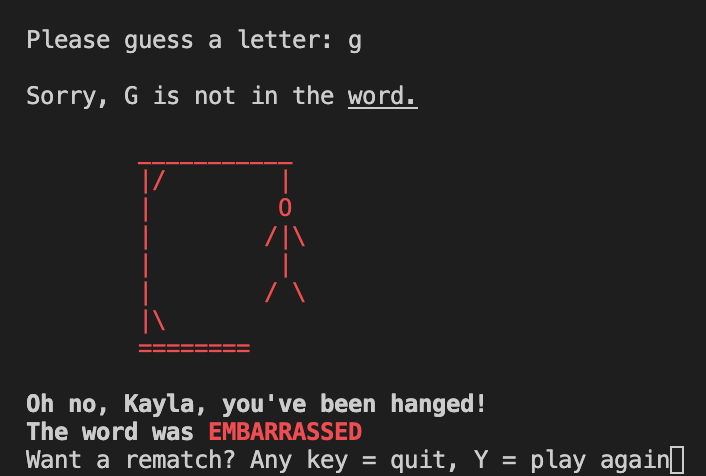
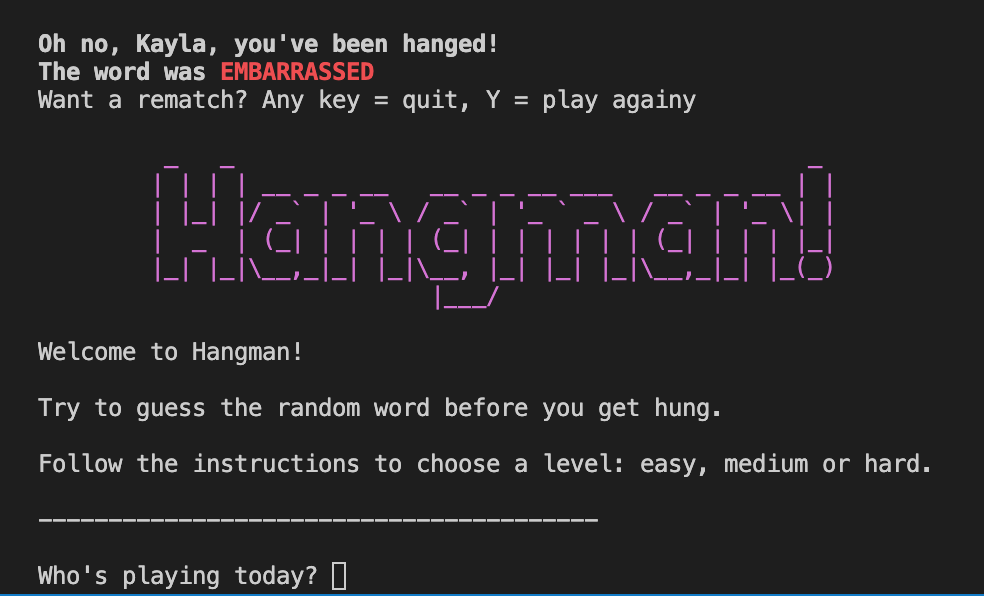
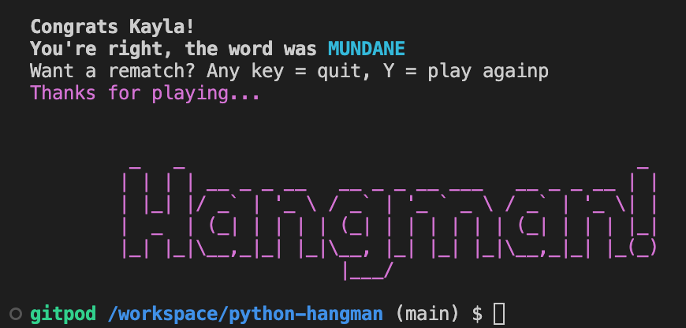
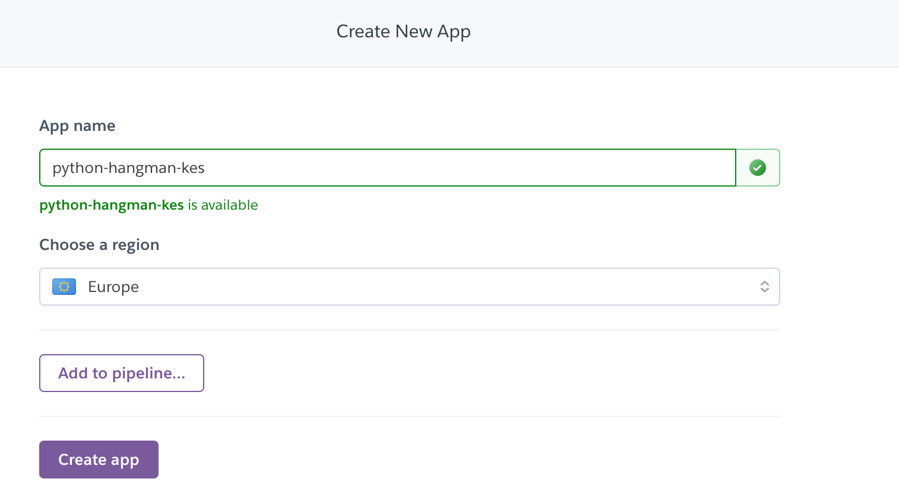
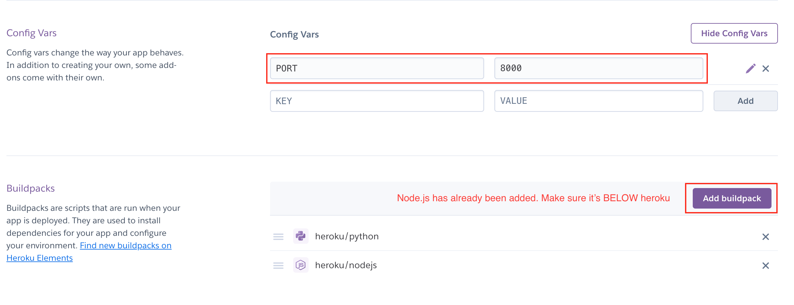
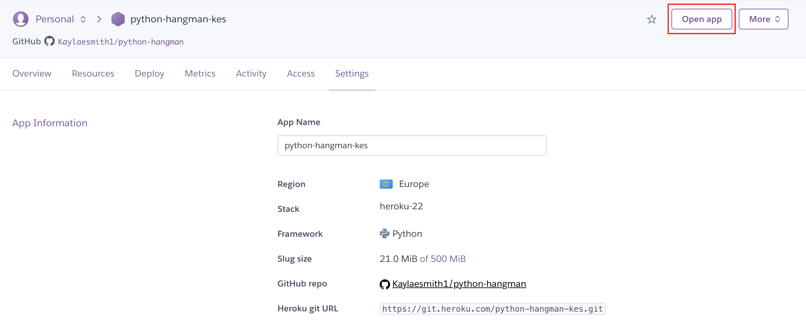
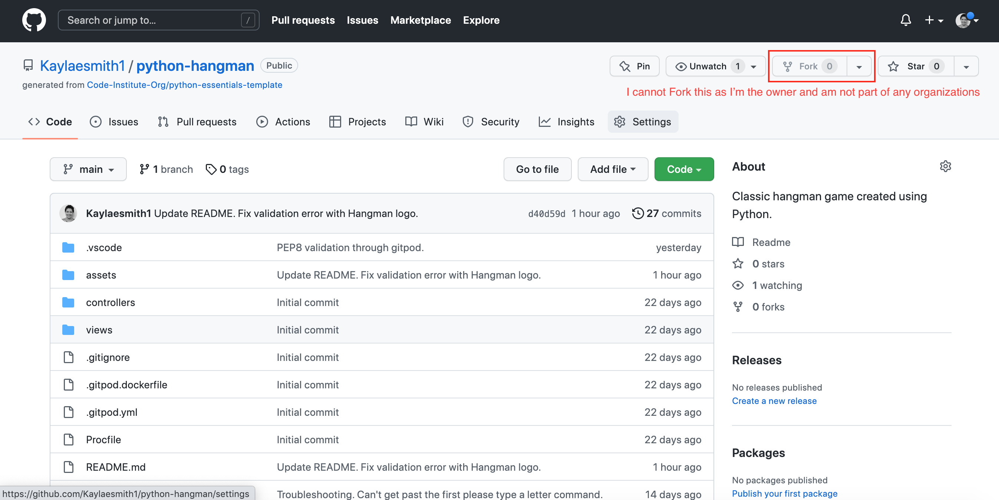
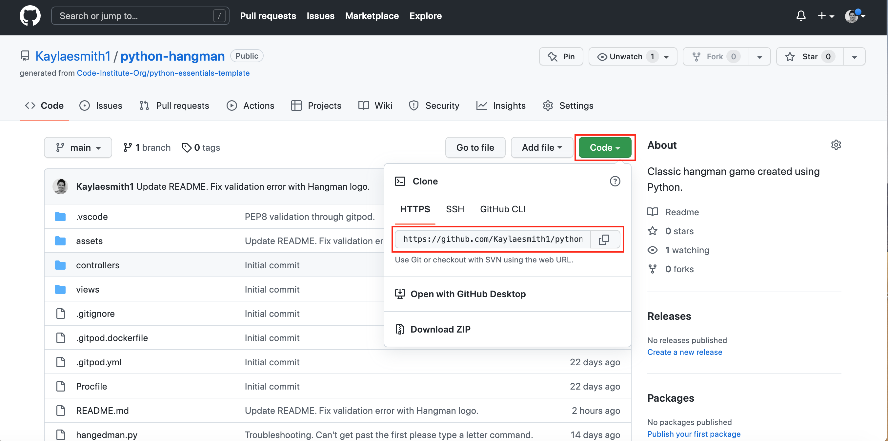

# INTERACTIVE HANGMAN GAME

This hangman game is a Python terminal game, deployed on Heroku. The overall aim of this game is for the player to have fun trying to guess a random word of a varying length, based on the difficulty level chosen by the player. Secondarily, this game could be used, both with native English speakers and English learners as a way to broaden their vocabulary. Finally, the game can help keep the mind sharp. By guessing letters and critically thinking of [letter patterns and common letters](https://en.wikipedia.org/wiki/Hangman_(game)) in the English language, the player can use skill to win the game.

The user can play the game at three different levels of difficulty (based on lenghth of word). The player wins the game if they guess the word correctly in the allotted number of guesses. They lose if they fail to guess the correct word in the number of guesses given based on the level of difficulty they chose: 5 lives for EASY, 7 for MEDIUM and 10 for HARD.

After each incorrect guess, a life is lost and the contruction of the gallows and the hanging figure increases.

At the beginning of the game, the player is asked to give their name, which is then used to wish them luck and, at the end of the game, congratulate them on winning or give condolences on their loss.

Once the game is finished, the player is asked if they'd like to play again. Entering 'Y' will restart the game with a new random word and the difficulty level chosen by the player. Entering in anything other than 'Y' ('N' or another character) will conclude the game with a 'Thanks for playing...' message.

 ## Game FlowChart
 When planning the game, I thought about what commands and what user input would be needed for the game to work. Do aid in development, I created this flowchart using [Lucid](https://lucid.app/documents#/dashboard) to help visualize the final game flow.

## How to play

First the player chooses a level of difficulty and a random word will be shown using ( _ ) markers for the letters. The player will then guess one letter at a time. If the letter is part of the word, it will appear in lieu of one of the blank spaces ( _ ). If the letter is not in the word, a life will be lost and a part of the gallows or a body part of the figure will appear. 

The player continues guessing until they complete the word correctly, winning the game, or until all lives are lost and they are hung, signifying the game is over. For either outcome, an end of game message will appear incorporating the name the player entered at the beginning. The player will then have the opportunity to play again, with a different random word, should they choose. 

## Features

* Player is greeted with a welcome message, the instructions of the game and asked for their name.

* The player chooses a level of difficulty (easy, medium, hard) and the number of lives is reflected (10, 7, 5, respectively).

* A function generates a random word for the player to guess. The word is shown as a set of underscores symbolizing each letter. The underscore characters are shown as letters when the player guesses a correct letter. 

* If the player makes an incorrect guess they are told, a life is lost and the gallows and hanging figure are built piece by piece (letter by letter). The number of lives remains unchanged if the player guesses a correct letter.

* Error message shown for: duplicate guesses, numbers or special characters (invalid letters) or two letters / characters at a time.

* When the game is over, the player is either congratulated or given condolences by name.

* The player is then asked if they'd like to play again. If so, the game restarts from the beginning with a new random word, the number of lives reset and the gallows deconstructed. 

* If the player chooses not to play again, the game ends and they're sent off with a 'Thanks for playing' message and they exit the game.

* Various colors were included for aesthetic purposes and as a way to guide the player: E for easy level is in green, for example, yellow for medium and red for hard when the player chooses a level at the outset. Color also used for the player's name at the beginning, congratulatory and condolence messages at the end of the game.

## Testing

* Tested for various bugs and functionality.
* Tested for all scenarios with invalid guesses (numbers, special characters).
* Tested for all scenarios with successful guesses (valid letters only).
* Friends and colleagues did the same once the first round of testing was completed by the creator (me).
* This game was only tested in Chrome, Safari and Firefox browswers on a Macbook Pro laptop device. The app worked well in all browsers.

## PEP8 valitated (in Gitpod workspace)
* Since the Pep8 website is having some issues, I added the Pep8 validator into my Gitpod workspace directly, following the Code Institue instructions. 
* All errors and warnings were fixed, barring a few warnings for 'invalid escape sequence'. These do not affect the functionality of the game and I chose to leave them as they are a vital part of the aesthetic of the 'Hangman' logo. 

* Other validation errors had to do with extra white space at the end of lines, indentation issues and lines over 79 characters long. All have been fixed.

## Bugs

1. At the end of the game, the player is asked if they want to play again. The player had to enter 'N' twice before the 'Thanks for playing' and hangman logo appeared. The while loop was breaking in the wrong place; this is now fixed.

2. The aforementioned while loop was also causing an error in asking the player if they wanted to play again. At the end of game one, the player was asked if they wanted to play again. If they chose to, the game ran again but at the end did NOT ask if they wanted to play a third time. This is solved now in correcting the syntax of the while loop. It now works properly if the player chooses to play again or to quit. 

3. Choosing the number of lives wasn't working properly at the outset but I wasn't calling the function properly. Changing lives = 10 (player will always have 10 lives, regardless of difficulty chosen) to lives = choose_level() fixed the problem. Now the player will get 10, 7 or 5 lives depending on level of difficulty chosen.

## Points of improvement

1. The final letter of the game is not currently shown in the 'Current word:', rather it's highlighted as part of the congratulatory message just under the player's final (correct) guess. Aesthetically, it would be best to have both the word completely written out in the game board and written as congratulations below.

2. The levels could be different. It might be better to have the level of difficulty based on the number of letters in the word rather than the number of lives.

3. As I mentioned in the 'Testing' section, this application was only tested on laptop devices in various browsers. This was done deliberately. The app is not responsive nor functions on a mobile phone. Since this app is a backend application working through a terminal, I chose to focus on functionality in the terminal. This could however be a point of improvement in the future; it would be fun to be able to play the game on a mobile phone. 

## Deployment to Heroku

This project was deployed on Heroku in the following manner:

1. Log into the [Heroku website](https://www.heroku.com)

2. Click 'New' and choose 'Create new app'. 

3. Choose an app name (this does NOT have to be identical to GitHub) and a region.

4. Click 'Create app'.

5. You should be on the 'Deploy' tab (1).

6. Choose connect to GitHub account (2).

7. Search for the repository you want to deploy. The name needs to match exactly (3).

8. Click 'Connect' (4).

9. Select whether you want automatic deployment.

10. Choose which branch you want to deploy. 

11. Click 'Deploy branch'

12. When the deployment is complete, go to the 'Settings' page to configure vars and buildpacks. 

13. Click 'Reveal Config Vars'. For this project, we needed PORT 8000 (as a var) and the Node.js and Python buildpacks.

14. Click 'Add' to fill out PORT and 8000 in he KEY / VALUE pair. This has been done.

15. Click 'Add buildpack' and select Node.js from the options.

16. Scroll back to the top where you will see 'Open app'. BEFORE opening, you will need to redeploy as the first deployment happened before Node.js was installed as a buildpack. If you open now, there will be an error.

## Forking the repository on GitHub

GitHub enables other developers (or whomever) to copy repositories so they can be viewed and changed by others without any edits affecting the original.

To do this, the following steps are necessary:

1. Log in to GitHub and locate the repository. 

1. Click the 'Fork' button at the top right to copy.

## Cloning the repository on GitHub

You can also clone the repository on GitHub. 

1. Click the green 'Code' button.

2. Click on the two overlapping papers to copy the URL

3. Open Git Bash in the browser.

4. Change the working directory a directory you want your clone to be in.

5. Type 'git clone' and paste the copied URL.

6. Click 'enter' and the clone will be finished.

## Credits

- I used the [Code Institute Python template](https://github.com/Code-Institute-Org/python-essentials-template) for this project.

- I used a [YouTube tutorial](https://www.youtube.com/watch?v=cJJTnI22IF8&t=2s&ab_channel=KylieYing) by Kylie Ying for general background knowledge and used her list of words in the words.py file. I also used her logic in this video to edit out spaces and '-' characters in the list of words used for the game.

- The Hangman graphic was designed using [this software](https://patorjk.com/software/taag/#p=display&f=Standard&t=Hangman!).

- For timed space betweeen printed statements I imported sleep() from time, which I found through a [Google search](https://www.freecodecamp.org/news/the-python-sleep-function-how-to-make-python-wait-a-few-seconds-before-continuing-with-example-commands/#:~:text=Make%20your%20time%20delay%20specific,after%20a%20slight%20delay.%22).

- To incorporate colors and font weights, I used the 'class' method found through a [Google search](https://www.delftstack.com/howto/python/python-bold-text/#:~:text=text%20in%20Python.-,Print%20Bold%20Text%20in%20Python%20Using%20the%20ANSI%20Escape%20Sequence,%3A%20'%5C033%5B1m'%20) and labeled and called the colors and bold type accordingly.

- I had some issues with my while loop in calling the game function again should the player want to play again. I credit Ed B_Alum on Slack for helping, as well as Sean in a tutoring session. Both of their input and ultimately Sean's redefining of my while loop solved the bug and made my code cleaner. 

- Though it was unnecessary to import outside libraries for this project, I did import a couple of libraries that were already part of the Python program: random, string and sleep, which were used to randomize words, link letters of the alphabet, and delay printed messages, respectively. I also created two files: words.py and hangedman.py. The former is a [list of words](https://raw.githubusercontent.com/kying18/hangman/master/words.py) (taken from the Kylie Ying tutorial mentioned above) and the second is a graphic based on the number of lives left I used from [gibbo101's](https://github.com/gibbo101/hangman) hangman game.